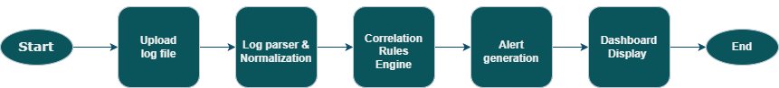

# 🔍 Automated Log Correlation Tool (ACLT)

A **SOC (Security Operations Center) Log Analysis Dashboard** built with [Streamlit](https://streamlit.io/) that automatically correlates security log events to detect suspicious activity and potential cyber threats.

---

## 🚀 Features

| Feature | Description |
|---|---|
| **CSV Log Upload** | Upload security log files in CSV format via the web interface |
| **Log Normalization** | Auto-normalizes column names, events, usernames, and IPs |
| **Brute Force Detection** | Flags IPs with **5+ failed logins** followed by a successful login |
| **Suspicious File Access** | Detects login → file download patterns (potential data exfiltration) |
| **Severity Alerting** | Color-coded alerts — 🔴 High / 🟡 Medium |
| **Log Statistics** | Metric cards showing total events, unique IPs/users, failed logins |
| **Interactive Dashboard** | Searchable log table with clean, modern dark theme |

---

## 🔄 Workflow



**Upload → Parse & Normalize → Correlation Rules → Alert Generation → Dashboard**

---

## 📋 Expected CSV Format

| Column | Description | Example Values |
|---|---|---|
| `event` | Security event type | `login_failed`, `login_success`, `file_download` |
| `ip` | Source IP address | `192.168.1.10` |
| `user` | Username | `admin`, `jdoe` |

> Column names are case-insensitive — the tool normalizes them automatically.

---

## 🛠️ Setup

### Prerequisites
- Python 3.8+
- pip

### Install & Run

```bash
pip install -r requirements.txt
streamlit run app.py
```

The dashboard opens at `http://localhost:8501`.

---

## 📂 Project Structure

```
log_correlation_tool/
├── app.py              # Main Streamlit application
├── requirements.txt    # Python dependencies
├── ACLT.png            # Application screenshot
├── ACLT_flowchart.png  # Workflow flowchart
├── .gitignore
└── README.md
```

---

## 🔐 Detection Rules

### 1. Brute Force Login Attack — 🔴 High

Triggered when an IP has **5+** `login_failed` events **and** at least one `login_success`. Indicates a successful brute force attack.

### 2. Suspicious File Access — 🟡 Medium

Triggered when a user has both `login_success` **and** `file_download` events. May indicate unauthorized data exfiltration.

---

## 💡 Use Cases

- **SOC Analysts** — Quick triage of uploaded log files
- **Incident Response** — Correlate events to reconstruct attack timelines
- **Cybersecurity Students** — Hands-on log correlation learning
- **Small Organizations** — Lightweight threat detection without expensive SIEM

---

## 📄 License

Open-source. Feel free to use, modify, and distribute.
